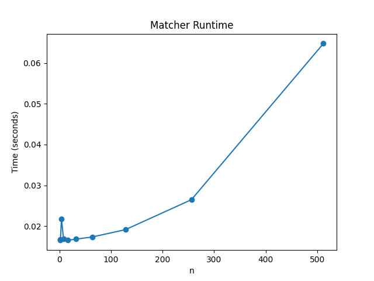
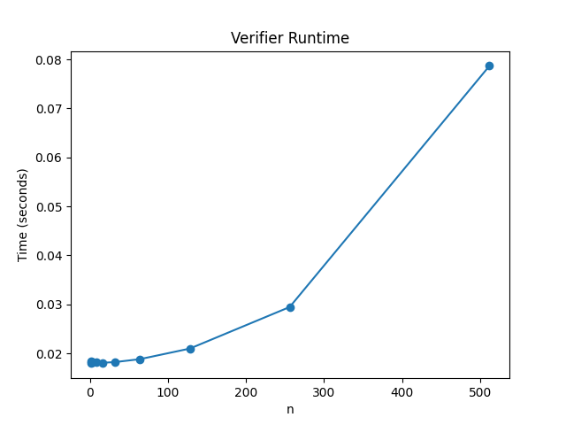

# COP4533-Matching-and-Verifying

This repository contains the implementation for the COP4533 Programming Assignment 1 on stable matching and verification using the hospital-proposing Gale–Shapley algorithm and a verifier to check validity and stability. It also includes scalability experiments measuring runtime performance.

## Team Members
- Name: Yuyang Sun, UFID: 38133550  
- Name: Junhao Li, UFID: 51521823

## Requirements / Dependencies
- Python **3.x**
- No external libraries are required for Task A and B.
- For Task C plotting: matplotlib

## Project Structure
- `src/` : Core implementation files (Task A & Task B)
  - `matcher.py` : Implements the hospital-proposing Gale–Shapley algorithm (Task A).
  - `verifier.py` : Verifies whether a proposed matching is valid and stable (Task B).

- `data/` : Example input/output files for quick testing
  - `example.in` : Sample preference input file.
  - `example.out` : Sample matching output file.

- `scripts/` : Helper scripts for testing / debugging / scalability experiments
  - `generate_in.py` : Generates random `.in` preference files of size `n`.
  - `generate_out.py` : Generates random valid `.out` matchings (debug/format testing only; may be unstable).

- `README.md` : Project documentation and usage instructions.

## Input Format

### Matcher

Input describes preferences for a one-to-one market with complete strict rankings.
1. First line: integer `n`
2. Next `n` lines: hospital preference lists (each line is a permutation of `1..n`)
3. Next `n` lines: student preference lists (each line is a permutation of `1..n`)

### Verifier

The verifier takes **two input files**:
- **Preference file (`.in`)**: the same format as the matcher input, containing the hospital and student rankings.
- **Matching file (`.out`)**: the proposed matching to be verified.

The `.out` file must contain exactly `n` lines, each in the format:

```text
h s
```
Meaning hospital `h` is matched to student `s`.

## Output Format 

### Matcher

The matcher prints **n lines**, one per hospital `i`:

```text
i j
```    
meaning hospital `i` is matched to student `j`.

### Verifier

The verifier prints a single status message if the matching is both valid and stable:

```text
VALID STABLE
```

Otherwise, it prints one of the following depending on whether the matching is invalid or contains a blocking pair:

```text
INVALID: ...
UNSTABLE: Blocking pair (h, s)
```

## Task A: Matcher

### Description

Implements the hospital-proposing Gale–Shapley algorithm to compute a stable matching.
Hospitals propose to students in order of preference, and students tentatively accept the best proposal received so far.

### How to Run
Example Input file: data/example.in

From the repository root, run:

```bash
python3 src/matcher.py data/example.in
```
Output: prints n lines in the format i j (one line per hospital).

## Task B: Verifier

### Description

The verifier checks whether a proposed matching is:
- Valid (one-to-one, all IDs in range, no duplicates)
- Stable (no blocking pairs)

### How to Run
Example Input file: data/example.in
Example Matching Output file: data/example.out

From the repository root, run:

```bash
python3 src/verifier.py data/example.in data/example.out
```
Output: prints one of the following messages:
- `VALID STABLE` (matching is valid and stable)
- `INVALID: ...` (matching is not a valid one-to-one assignment)
- `UNSTABLE: Blocking pair (h, s)` (matching contains a blocking pair) 

## Task C: Scalability and Runtime Analysis

### Description
We measure the running time of both the matcher and the verifier for increasing problem sizes:
```text
n = 1, 2, 4, 8, 16, 32, 64, 128, 256, 512
```
For each n:
- Random preference inputs are generated
- The matcher and verifier are each run multiple times
- The average runtime is recorded

### How to Run
Activate your virtual environment first, then run:

```bash
python3 scripts/task_c.py
```

### Output Files

Task C generates the following files in results/:
- taskC_matcher.png — matcher runtime vs n
- taskC_verifier.png — verifier runtime vs n
- taskC_times.csv — raw timing data

### Matcher Runtime



### Verifier Runtime




### Observed Trend (Task C Conclusion)

The running time of the matcher increases roughly quadratically as n grows, which matches what we expect from the Gale–Shapley algorithm.

The verifier runtime also increases with larger values of n. In our experiments, it can take slightly longer than the matcher for large inputs, but its growth rate is generally less steep.

Overall, both the matcher and the verifier scale in a predictable way and run efficiently for moderate problem sizes.
